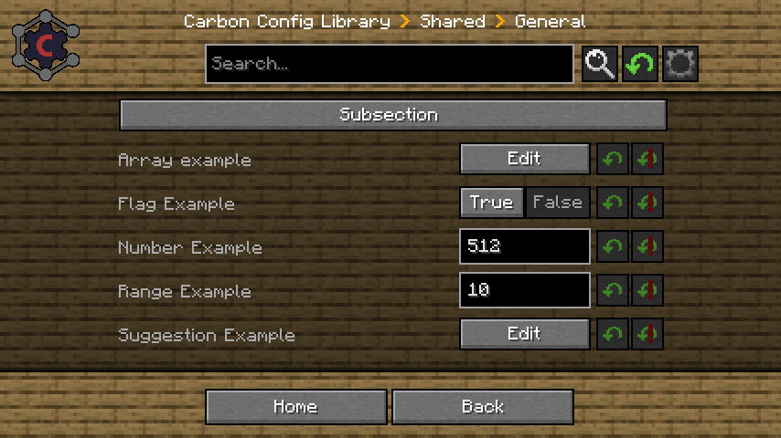
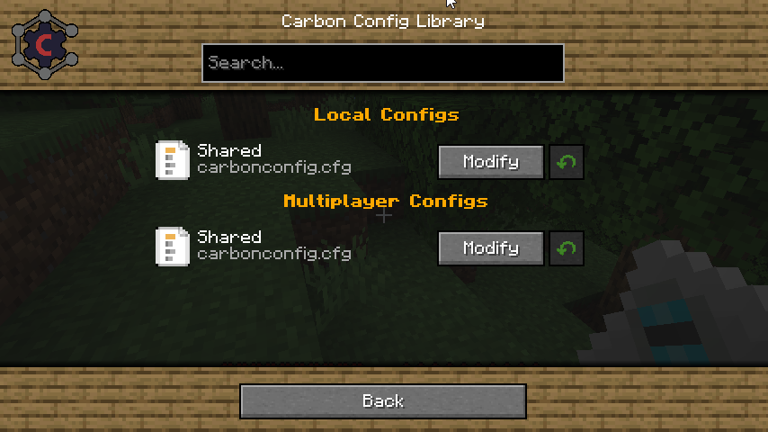
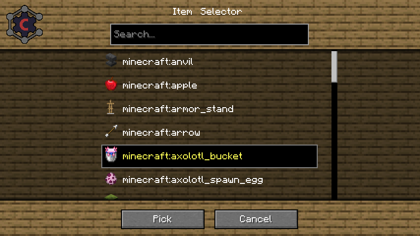
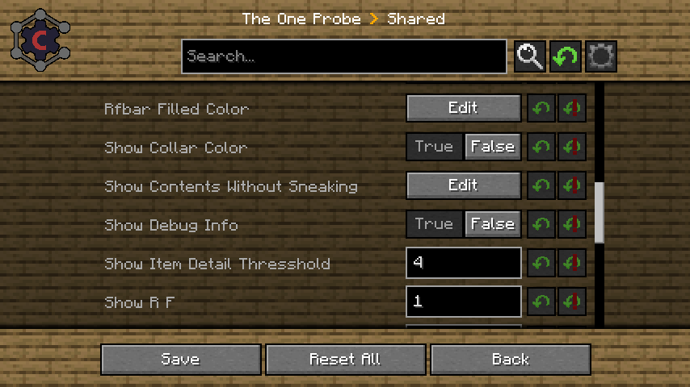

# CarbonConfig

Carbon Config is the GUI implementation of the [Carbon Config Library](https://github.com/Carbon-Config-Project/CarbonConfigLib).   
This project started as a IC2Classic exclusive library that later on was also installed into Chunk Pregenerator and now is a standalone library/mod.   

## Motivation (For Devs)

MinecraftForge/NeoForge has its own Config System that works somewhat fine.   
But sadly as Neoforge recently [admitted](https://github.com/neoforged/NeoForge/issues/32) the Config Library could self nuke at random.   
Or simply when a value was invalid reset irrelevant settings when a different setting was broken.    

Being fed up by this we (Meduris/Speiger) decided to make our own config system.   

Here is a list of what features we append when compared to forge.    

- **More Control**:    
  ``You decide when something loads/unloads. There is defaults in place to allow developers to give up control to make it simpler but if wanted there is 100% when a config loads and when not.``     
  ``On top of that you can have multiple configs of any type you desire.``    
- **Late Loading Support**:    
  ``If the config was loaded early but there is config elements that HAVE TO load late, they can be inserted later and no harm was done. Especially useful if you want plugins to have configs but also have them take effect instantly``   
- **Custom Entry Support**:    
  ``Missing a feature? No Problem, said feature can be appended in the config from external ways. Not much is hardcoded``   
- **Specialized Configs Wrappers**:    
  ``Need an array that should be actually a set? Or a Config that is Mapped? Carbon Config comes with these features built in that require very little code to be added and work right out of the gate``   
- **Parsing Support**:    
  ``Want a DataType to be parsed directly to make coding easier on yourself? The Parsed Config allows you to make any datatype be directly created and visualized in the GUI directly``   
- **Customization Support**:    
  ``Carbon Config comes with settings that allow to override some behaviors. Such as how multilines with arrays are handled, where the log goes, which subfolder is used or what folder at all is used.``
- **Hidden Configs**:    
  ``Do you have some April fools settings that should be able to be toggled, but you don't want them always visible? Hidden Configs are a thing that only will be saved if they were manually saved inside the file in the first place``    
- **Per World Proxies**:   
  ``Need per world support? But don't like that a default "Config" isn't present within the Config folders? Carbon Configs Proxy system got you covered. It allows you to define where and how configs are loaded.``    
  
### Developer Guide

A Developer Guide can be found [Here](DEVELOPER_GUIDE.md)

## The GUI

Carbon Config isn't just a Config Library it is also a GUI implementation for other Config Libraries.    

### Simple Config
    
    
This example shows you a basic button config layout.   
Where all the valid types are displayed.    

### File Selector

If there is multiple config files inside the mod it also automatically allows you which one you want to edit.   
    
    
Which also supports Editing of ALL Multiplayer files if you are on a server.    
Not just "server specific configs".   

### Suggestions

Carbon Config also comes with Selectors for config settings.   
These for most cases have to be implemented by the dev via "suggestions".    
But some config types like Registry Lists come with them as default.    
    

This for example is a Item Selector example where it also shows you which item is what.    

### Supported Special Types

The following supported types by default are:    
- Items
- Blocks
- Fluids
- Potions
- Enchantments
- Colors    

### Forge Config Support

Carbon Config also supports Forge Configs for its GUI interface    
    
    
As can be seen the One Probe Config works just fine.    
The GUI also supports Configured configurations regarding backgrounds.   

## FAQ

Q: **Is this mod required on the server or client?**    
A: ``No, It will detect if either side has the mod not installed and adjust automatically``    

Q: **Does it support editing shared forge configs on the server too?**    
A: ``Yes``    